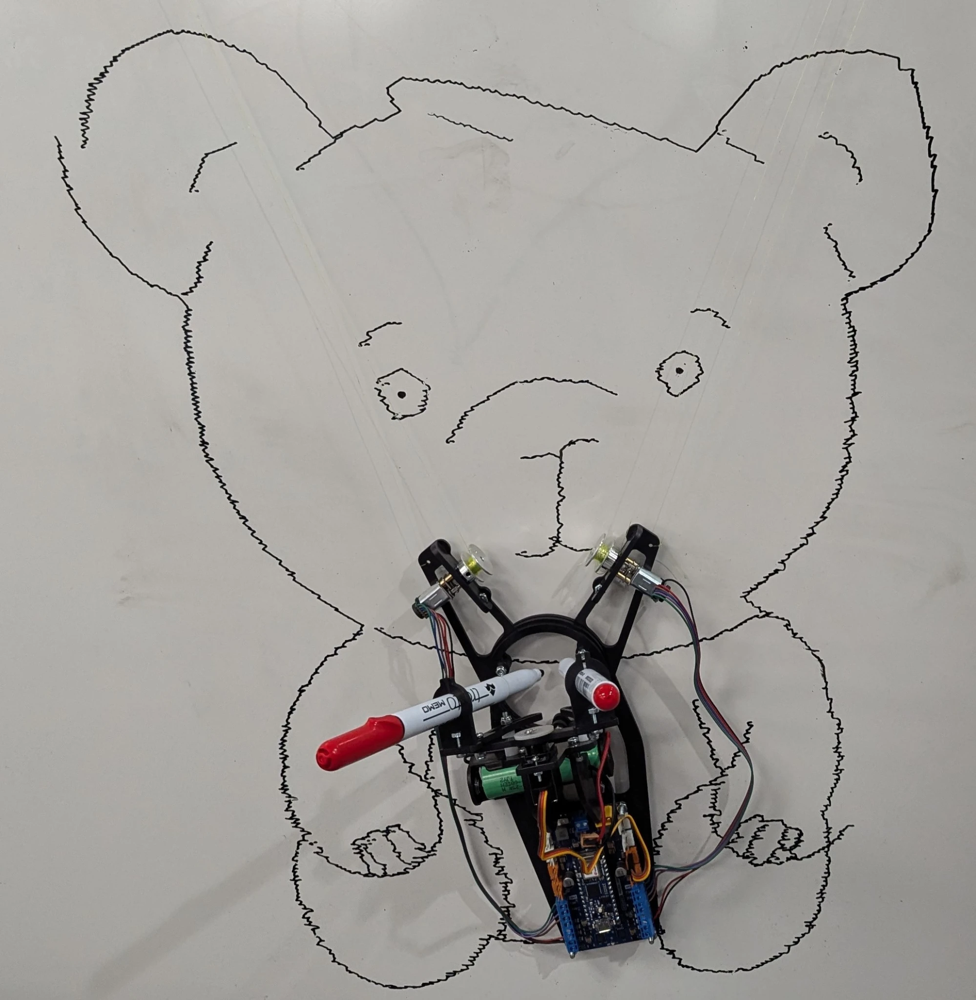
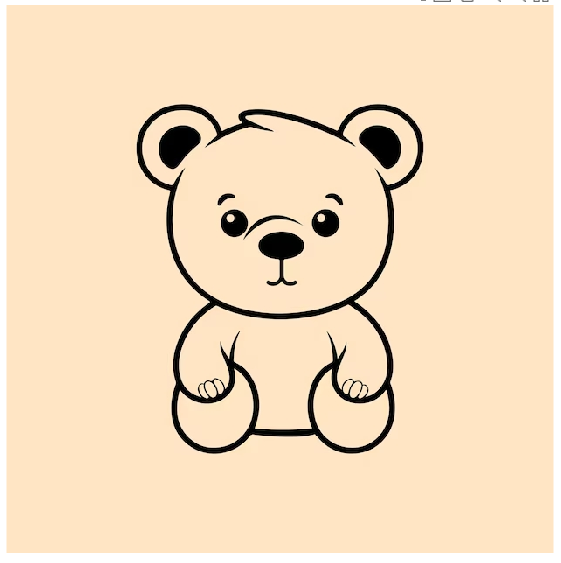
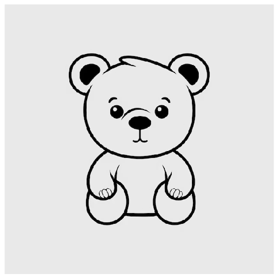
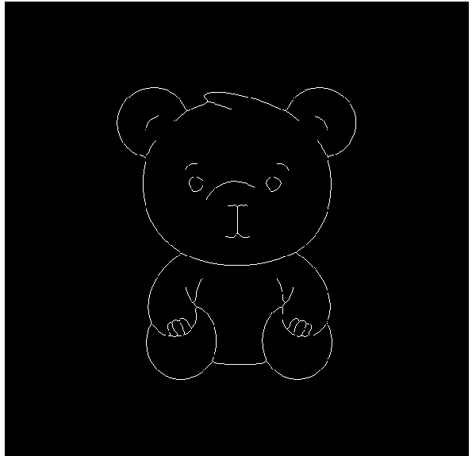
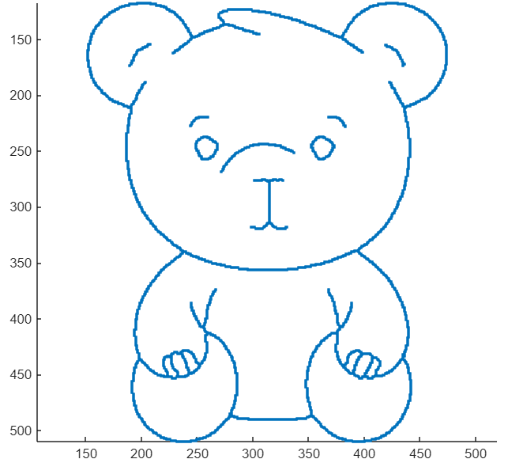
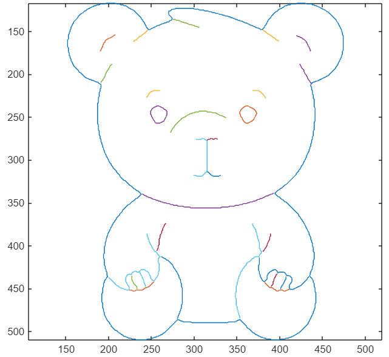

# Vertical Wall-Climbing Drawing Plotter

A mechatronic system that converts any colour image into a physical drawing on a vertical whiteboard — using inverse kinematics, real-time PID control, and encoder feedback on an Arduino Nano.



---

## What It Does

The robot hangs from a whiteboard via two cable-driven DC motors. Feed it any colour image — it processes it into a plottable trajectory, computes the required motor angles using a physics-based IK model, and draws the image in real time. A micro-servo controls a pen lift mechanism for 2-bit colour output.

---

## Image Processing Pipeline

The full pipeline from source image to motor commands, visualized:

| Step | Output |
|---|---|
| 1. Source image |  |
| 2. Grayscale conversion |  |
| 3. Binarization + morphological filtering |  |
| 4. Edge extraction |  |
| 5. Pixel path extraction |  |
| 6. Segmented drawable paths (colour-coded) |  |

Each colour in step 6 represents a separate drawable segment — the order these are sent to the robot determines the drawing sequence.

---

## System Overview

```
Colour Image
     ↓
Grayscale → Binarize → Morphological filtering (dilation + erosion)
     ↓
Pixel extraction → Recursive segment merging → Scale to board coordinates
     ↓
Physics-based IK model → Motor shaft angles (with torque constraints)
     ↓
Arduino Nano 33 IoT — PID loop + encoder feedback
     ↓
2× DC Motors + Micro-servo → Robot draws on whiteboard
```

---

## Hardware

| Component | Purpose |
|---|---|
| Arduino Nano 33 IoT | Real-time control, PID loop execution |
| 2× DC motors with encoders | Cable-driven XY movement across whiteboard |
| Micro-servo | Pen lift — marker up/down between segments |
| Marker pens (2 colours) | 2-bit colour drawing output |
| Whiteboard + mounting hardware | Drawing surface and robot suspension point |

---

## Software

### MATLAB — Image Processing Pipeline
- Converts colour image to grayscale, then binarizes it
- Applies morphological dilation and erosion to remove noise and close gaps in geometry
- Recursively extracts pixel paths and merges them into clean, motor-executable segments
- Applies a scaling factor to map pixel coordinates to physical whiteboard distances
- Outputs an ordered list of (x, y) board coordinates per segment

### MATLAB — Inverse Kinematics Model
- Takes target (x, y) board coordinates and computes required cable lengths geometrically
- Translates cable lengths into required DC motor shaft angles using trigonometry and linear mechanics
- Models gravitational and tension forces via free-body diagrams to compute motor torque at each board position
- Constrains robot movement to zones where motor load stays below 30% of stall torque — prevents stalling and slipping near board edges
- Generates torque plots across the full drawing surface to visualize safe operating zones

### Arduino — Real-Time Control
- Reads encoder counts from both motors at runtime to track actual shaft position
- Computes positional error between current and target angle
- Runs a PID control loop to drive each motor toward target with minimal overshoot and oscillation
- Coordinates servo state (pen up/down) with segment boundaries from the MATLAB trajectory data

---

## Key Engineering Challenges

**Torque constraints across the board surface:**
Motor load varies significantly depending on where the robot is on the whiteboard — cable geometry and gravity create very different tension loads near the top vs. the bottom corners. Free-body diagrams were used to model these forces at each position, and the IK model was constrained so the robot only moves in zones where load stays below 30% stall torque.

**Cleaning up image geometry:**
Raw pixel extraction produces noisy, fragmented paths that cause jerky or invalid robot motion. Morphological dilation and erosion were applied before extraction to close gaps and remove artifacts, and recursive segment merging reduced the total number of pen lifts and produced smoother drawing paths.

**Closing the control loop:**
Without encoder feedback, cable slip and motor variation caused significant positional drift across a drawing. Encoder counts were fed into a PID loop to continuously correct error, with gains tuned empirically to balance tracking accuracy against motor oscillation.

---

## Results

The robot successfully reproduced recognizable images on a vertical whiteboard with accurate path following and stable motor control. The bear image above was drawn using the full pipeline from source image to physical output.

---

## Tech Stack

`Arduino` `MATLAB` `C++` `PID Control` `Inverse Kinematics` `Encoder Feedback` `DC Motors` `Servo Control` `Image Processing` `Morphological Operations` `Fusion 360`
